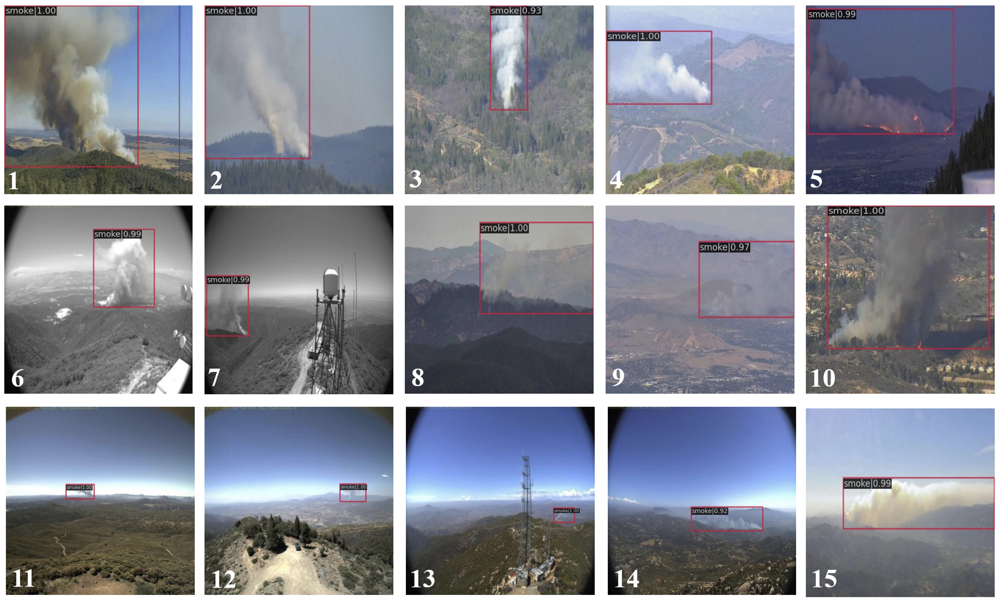
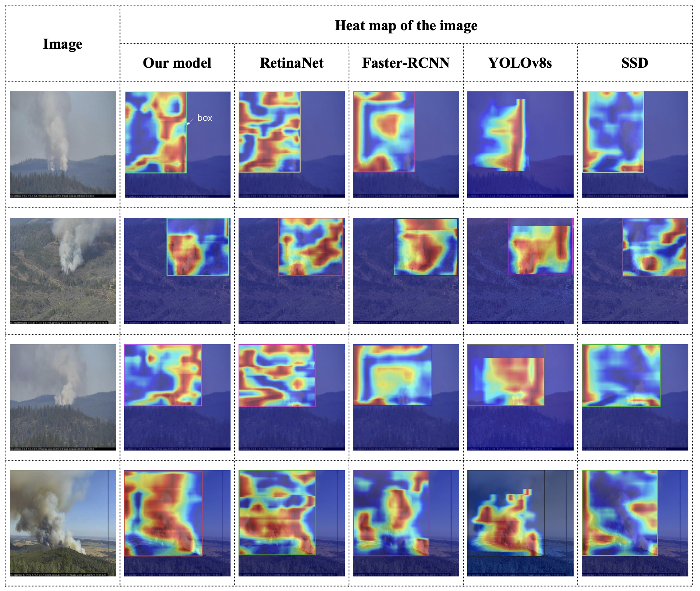

# An Efficient Forest Smoke Detection Approach Using Convolutional Neural Networks and Attention Mechanisms

PyTorch implementation of our method for forest smoke detection using convolutional neural networks and attention mechanisms.

The qualitative results:


Heat maps of the images to which different models are applied:


### Inferences
Follow commands below to perform detection:

- Image_Detection:
```
python detection/image_detection.py {image_path} --show
```	
- Video_Detection:
```
python detection/video_detection.py {video_path} --show
```	
- Camera_Detection:
```
python detection/camera_detection.py
```	
- Stream_Detection:
```
python detection/stream_detection.py {camera_address}
```
### Acknowledgments
This code borrows heavily from: https://github.com/open-mmlab/mmdetection